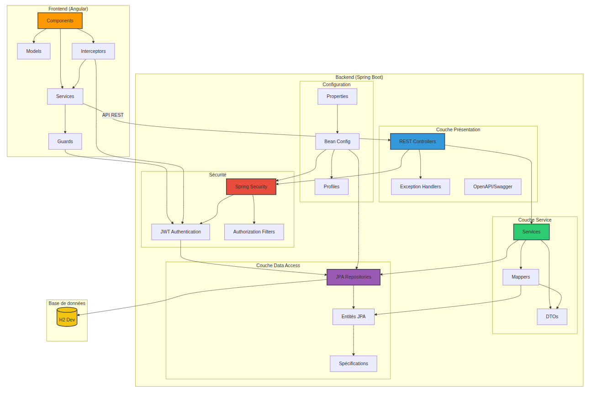
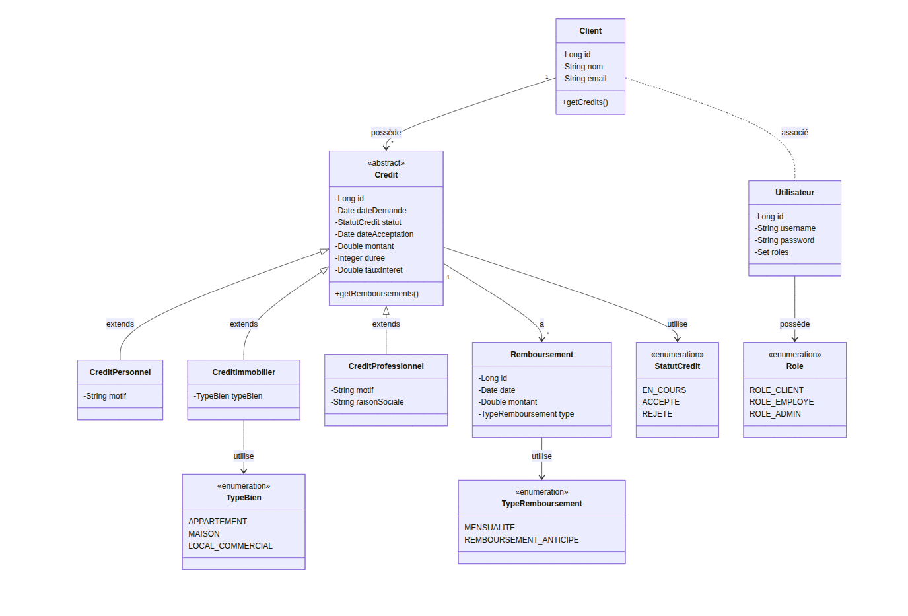

# Banking Credit Management System

This project is a Spring Boot application for managing banking credits with an Angular frontend. It was developed as part of the JEE examination by Mohammed El Badry.

## Screenshots

### Architecture Overview


### UML Class Diagram


## Project Overview

The application offers comprehensive banking credit management with the following features:
- A client can have multiple credits of different types
- Three specialized types of credits are supported: 
  - Personal Credit (Crédit Personnel)
  - Real Estate Credit (Crédit Immobilier)
  - Professional Credit (Crédit Professionnel)
- Each credit can have multiple repayments (remboursements) with different types
- Secure authentication and authorization via Spring Security with JWT
- RESTful API architecture for easy integration with frontend applications

## Architecture

The application follows a layered architecture:
- DAO layer based on Spring Data, JPA, Hibernate, and JDBC
- Service layer with interfaces and implementations
- Web layer based on Spring MVC using REST Controllers

## Entity Model

The application follows an object-oriented domain model:

### Core Entities
- **Client**: Defined by id, name, email, and associated credits
  - A client may have multiple credits and a user account

- **Utilisateur**: User account for authentication with username, password, and role

- **Credit** (Abstract): Base class for all credit types with common attributes
  - id, request date, status (EN_COURS, ACCEPTE, REJETE)
  - acceptance date, amount, duration, interest rate
  - Specialized into three concrete types:
    - **CreditPersonnel**: Personal credit with a reason/purpose field
    - **CreditImmobilier**: Real estate credit with property type (APPARTEMENT, MAISON, LOCAL_COMMERCIAL)
    - **CreditProfessionnel**: Business credit with purpose and company name fields

- **Remboursement**: Credit repayment transactions
  - Defined by id, date, amount, and type (MENSUALITE, REMBOURSEMENT_ANTICIPE)
  - Each remboursement is associated with a specific credit

## Technologies Used

### Backend
- Spring Boot 3.x with Java 17
- Spring Data JPA for data access
- Spring Security with JWT for authentication
- H2 Database for development and testing
- MySQL for production deployment
- Lombok for reducing boilerplate code
- MapStruct for efficient DTO-Entity mapping
- Swagger/OpenAPI for API documentation

### Frontend
- Angular with TypeScript
- Angular Material for UI components
- RxJS for reactive programming
- NgRx for state management (optional)
- Angular JWT for token handling

## Getting Started

### Prerequisites

- Java 17 or higher
- Maven 3.6 or higher

### Running the Application

1. Clone the repository
2. Navigate to the project directory
3. Run the application using Maven:
   ```
   mvn spring-boot:run
   ```
4. Access the application at http://localhost:8080
5. Access the Swagger UI at http://localhost:8080/swagger-ui.html

### Testing

Run the tests using Maven:
```
mvn test
```

## API Endpoints

The application provides the following API endpoints:

### Authentication
- POST /api/auth/login - Login with username and password
- POST /api/auth/register - Register a new user

### Clients
- GET /api/clients - Get all clients
- GET /api/clients/{id} - Get client by ID
- GET /api/clients/email/{email} - Get client by email
- POST /api/clients - Create a new client
- PUT /api/clients/{id} - Update an existing client
- DELETE /api/clients/{id} - Delete a client

### Credits
- GET /api/credits - Get all credits
- GET /api/credits/{id} - Get credit by ID
- GET /api/credits/client/{clientId} - Get credits by client ID
- GET /api/credits/statut/{statut} - Get credits by status
- POST /api/credits/personnel - Create a new personal credit
- POST /api/credits/immobilier - Create a new real estate credit
- POST /api/credits/professionnel - Create a new professional credit
- PATCH /api/credits/{id}/statut - Update credit status
- DELETE /api/credits/{id} - Delete a credit

### Remboursements
- GET /api/remboursements - Get all remboursements
- GET /api/remboursements/{id} - Get remboursement by ID
- GET /api/remboursements/credit/{creditId} - Get remboursements by credit ID
- GET /api/remboursements/type/{type} - Get remboursements by type
- GET /api/remboursements/date-range - Get remboursements by date range
- POST /api/remboursements - Create a new remboursement
- PUT /api/remboursements/{id} - Update an existing remboursement
- DELETE /api/remboursements/{id} - Delete a remboursement

## Security

The application uses Spring Security with JWT for authentication and authorization. The following roles are defined:
- ROLE_CLIENT - Regular client users
- ROLE_EMPLOYE - Bank employees
- ROLE_ADMIN - Administrators with full access

## License

This project is licensed under the MIT License.
